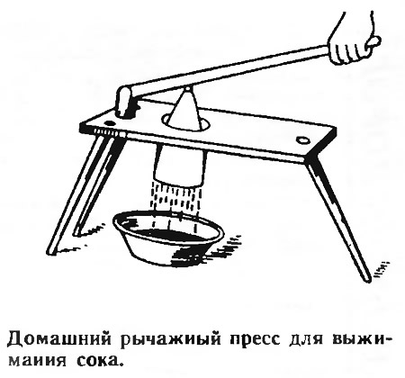

## ДОМАШНИЕ ВИНА
### Из ягод, фруктов и овощей

Процесс, предшествующий прессованию состоит прежде всего в том, что собранные ягоды  перебираются, то есть очищаются от мусора и испорченных, поврежденных ягод, и затем кладутся в какое-либо прохладное сухое место ровным слоем для того, чтобы они вполне дозрели. Такое дозревание особенно важно в том случае, если прессование намечено выполнять простейшим способом - выжиманием сока вручную через полотно. Впрочем, дозреванию различные ягоды подлежат далеко не в одинаковой степени. Чаще всего в нем может нуждаться красная смородина - главный материал ягодного виноделия.

===

Дальнейшая подготовка ягод к прессованию заключается в их размельчении, которое сопровождается разрывом оболочки плодов. Благодаря этому, с одной стороны, прессование происходит быстрее, а с другой - сок отделяется от мезги (раздробленной ягодной массы) совершеннее и полнее. Мягкие ягоды, например клубника и малина, в таком размельчении не нуждаются.

Дробление, как и все последующие операции с ягодами и ягодным соком, производится или в глиняных, или в деревянных, но только не в металлических сосудах. Металлические сосуды в данном случае могут употребляться разве лишь тогда, когда они эмалированы. Причина понятна: сок приходит в соприкосновение с металлом и получает нежелательные и даже вредные примеси.

В домашнем быту дробление ягод выполняется в больших глиняных горшках (корчагах) или чаще в корытах с помощью деревянной толкушки или песта.

Необходимо заметить раз и навсегда, что чистота при изготовлении ягодных вин составляет главное условие успеха. В подавляющем большинстве случаев неудачи при ягодном виноделии и порча сусла, а также неприятные привкусы уже готового и просветлившегося вина происходят из-за недостаточной внимательности и аккуратности. Как посуда, так и руки работающих должны быть совершенно чистыми.

Черная смородина хуже, чем другие ягоды, поддается дроблению, и отделение сока от мезги у нее происходит труднее. (Напомним, впрочем, что черная смородина употребляется редко, обычно как добавка к красной.) Для того чтобы сок у черной смородины отделялся легче, можно рекомендовать следующий практический прием. Очищенные и основательно вымытые ягоды кладут в глиняный горшок, который на ночь ставят в хорошо натопленную, но не чересчур жаркую печь. Сверху горшок плотно закрывают — например, сковородкой. К утру ягоды, если они были накрыты и не спеклись, будут представлять собой более или менее жидкую массу, отжать сок из которой гораздо легче, чем из сырых ягод.

К операциям подготовки ягод к прессованию нужно отнести также их предварительное (после раздробления) смешивание с водой. Это делается с целью более полного извлечения из них сока. О смешивании, впрочем, будет сказано далее.

Подготовительной операцией является и мытье ягод чистой водой, предшествующее их размельчению. Мытье вообще никогда нелишне, но особенно когда ягоды сильно запылились и загрязнились еще на кустах.

При подготовке к прессованию косточковых плодов следует заранее удалить из них косточки. Лишь для кизила делается исключение, его можно прессовать с косточками, так как они очень малы и тверды. Если даже они будут раздавлены прессом, это не повлияет заметным образом на привкус напитка.

## Прессование
Прессование ягод руками через полотно является самым нежелательным не только вследствие своей затруднительности, но также и потому, что в выжимке удерживается масса напрасно теряющегося сока.

Поэтому, если ставить цель ежегодно приготовлять ягодные вина, нужно запастись хотя бы самым простым и дешевым ручным прессом (см. рис.). Не только дно, но вообще вся нижняя часть его резервуара состоит из металлического сита, имеющего многочисленные маленькие отверстия для истечения выдавливаемого сока. Если есть возможность, гораздо практичнее обзавестись более солидным винтовым прессом.

Мезга помещается внутрь резервуара обыкновенно в кусках крепкого, но редкого (для более свободного прохода сока) полотна. По окончании каждой операции полотно следует тщательно промывать. Прессы и всякая другая утварь, используемая при прессовании ягод, тоже после завершения работ должны быть тотчас хорошенько обмыты.

## Посуда для сока, сусла и вина
Обычно все операции виноделия, вплоть до разлития вина в бутылки, ведут в деревянных или стеклянных сосудах, реже — в глиняных. Что касается железных, то таковые, как уже было сказано, должны быть при ягодном виноделии совсем изъяты из обращения.

Для размельчения ягод используются мелкая бочка, корыто или большой глиняный горшок, который, однако, от слишком энергичных действий толкушкой можно разбить.

В домашних условиях при выделке вина применяют либо небольшие бочонки, либо, как это бывает чаще всего, большие стеклянные бутыли (так называемые «сулеи»). Так как сулею легко расколоть, она всегда должна находиться в защитном чехле — ивовой плетенке или корзине с двумя ушками на противоположных сторонах. Между прутьями и стеклом самой бутылки прокладывается слой сена, меха или шерсти. Предпочтительны невысокие и широкие сулеи, поскольку некоторыми экспериментаторами ягодного виноделия замечено, что брожение сока в узких и высоких сосудах происходит хуже.

Немалое преимущество этих бутылей, как и вообще стеклянных сосудов, состоит в том, что их несложно мыть и содержать в требуемой чистоте. Для мытья бывших в употреблении бутылей берут соляную или неочищенную серную кислоту, в которой прополаскивают посуду в предпоследний раз. Разбавленная кислота растворяет любой осадок, находящийся на стенках бутылей, так что после обработки кислотой остается только как следует промыть бутыли чистой водой.

То же самое нужно сказать и про мытье бутылок. Их полное очищение быстрее всего достигается с помощью кислоты.

Относительно деревянной посуды - бочек и бочонков - следует прежде всего упомянуть, что лучшими для виноделия являются не новые, а уже бывшие в употреблении, то есть в которых содержалось или переливалось вино.

Где таких винных бочек нет, там приходится брать бочки из-под чего-нибудь другого. Они предварительно вымываются и вычищаются весьма тщательно. Многократная промывка производится кипятком с содой. Последние два раза промывание ведется только с помощью кипятка и воды, чтобы удалить из бочки следы соды.

Недостаток этих бочек заключается в том, что вино легко приобретает привкус содержащихся в них жидкостей. Бочки, окрашенные внутри, совершенно не годятся для ягодного виноделия. Особенно же следует избегать бочек из-под керосина, уксуса и тому подобных продуктов - такая посуда абсолютно непригодна.

Так что, раз под рукой нет бочки, бывшей под вином или новой и совсем чистой, в домашнем обиходе гораздо выгоднее воспользоваться стеклянными бутылями.

Если же предпочитают иметь дело с деревянной посудой, в которой было, например, прокисшее вино, можно посоветовать следующее. У бочки вынимают дно, а затем стенки изнутри тщательно обмазывают тестом из свежераспущенной извести, которое должно быть достаточно густым, чтобы хорошо держаться на поверхности древесины. Точно так же поступают и с дном, покрыв его тем же тестом. Обмазанную таким образом бочку оставляют на 24 часа или дольше, а затем известь удаляют и бочку внутри основательно промывают. Перед наполнением ее вином надо, однако, убедиться, что в полости бочки исчезли всякие следы кислотности. Для этого заливают туда немного воды и, обмыв ею стенки, дают ей отстояться. После этого берут лакмусовую бумажку и пробуют находящуюся в бочке воду. Если синяя лакмусовая бумажка окрасится в красный цвет, значит, бочка была сильно пропитана кислотой и обмазывание известковым тестом нужно повторить еще раз.

Если предполагается использовать новые бочки, нужно иметь в виду, что они должны быть сделаны из дуба, причем предпочтительнее дерево, срубленное в декабре или январе. В это время года древесина у дуба бывает наиболее плотной. Дерево же, срубленное в марте, обладает самой высокой пористостью.

Втулочное отверстие бочки не должно быть ни слишком велико, ни слишком мало, а саму втулку следует выстругать совершенно гладко и ровно, чтобы она могла плотно затыкать отверстие.

Новые, не бывшие в употреблении бочки подготавливают для заполнения соком или вином таким образом. Наполняют до половины кипятком, в котором распускают, не жалея, соду. Затем бочку плотно затыкают втулкой и начинают раскачивать, чтобы стенки изнутри хорошо обмылись.

Даже правильно приготовленные для виноделия новые бочки лучше сперва употреблять только для брожения, и лишь после того, как это будет проделано раза два, они станут вполне годными для хранения вина. Особенно следует избегать вливания в новые бочки белого вина — оно в таких случаях нередко принимает некрасивую бурую окраску.

Само собой разумеется, что бочка должна быть целиком сделана из одного и того же дерева, причем внутрь не должны проникать ни винты, ни гвозди. Иначе соприкосновение ягодного сока с железом повлечет за собой порчу вина.

Заплесневелая бочка чистится и моется вышеуказанным способом. Если же она была уж слишком подвержена плесени, то тогда ее разбирают (расклепывают), выпаривают и чистят в разобранном виде. После этого бочку снова склепывают и обрабатывают ректификованным спиртом, а затем очищают повторно.

Вообще-то заплесневелость бочек указывает на неаккуратность изготовителя, которой не должно быть ни при домашнем производстве, ни тем более при коммерческом виноделии.

Величина бочки влияет на процесс брожения. Чем бочка больше, тем брожение происходит полнее и совершеннее. Это обстоятельство необходимо иметь в виду, если выделка вина производится в более или менее обширных масштабах. (Оконч.- в № 2).

&#xf1f9; &laquo;САМ&raquo; 1'93