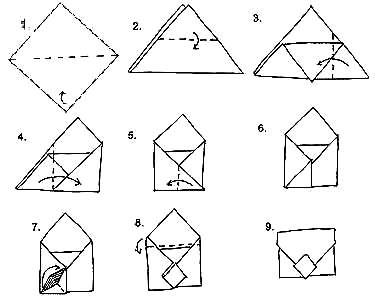

*   Согните квадратный лист бумаги по диагонали (если Вы отрезали квадрат от прямоугольного листа, такая диагональ у Вас наверняка уже согнута).
*   Сгиб проходит посередине, то есть, отогнутый уголок должен коснуться согнутой диагонали.
*   Сгиб делается на трети длины (можно прямо померять длину линейкой).
*   По сути, загибается тоже треть, угол доходит до самого правого края.
*   Уголок отгибается назад влево в месте, где сходятся левая и правая отогнутые трети.
*   Теперь раскрываем уголок и делаем из него закрепительный кармашек.
*   Загибаем верх конверта.
*   Вставляем верх конверта в подготовленный для этого кармашек.

> Учтите, что из обычного листа А4 можно сложить лишь конверт для открытки размером 10х7,5см (предварительно вырезав из него квадрат).
> <cite>source: http://www.vsehobby.ru/konvert_origami.html</cite>